# Macro

## Motivation

While developing a web-app, the complexity grows and we always have to refactor components and logics. We suffer from these phases:

1. Use existing component library.

   works seamlessly with their _documents_ and _props_, _slots_.

2. A common feature is required but unimplemented.

   The components' maintainers implement and we return the last phase.

3. Unusual requirements appear, but the maintainers reject implementing.

   We write stylesheets and monkey-patching code based on the components' inside implementations. As long as the requirements is simple enough, this is okay.

4. The unusual requirements become crazy.

   We fork the original component or re-implement one.

   Then we get business components and we start maintaining them. Inside them, these cycles repeats.

Experience shows that the 3rd and 4th is the most torturing part, like giving birth to something.

However, some components from the libraries, like "data table", are neither ubiquitous nor business components.
They are closer to **composites of logics and ubiquitous components** like "button, icon, text".

How to make those components easier to be forked, re-composed and maintained? Can we make them more modularized?

## Proposal

Inspired by React hooks, Vue composition API and Macro from C/C++, a new way to write those "composite-like" components is proposed. Code generating is involved in order to implement this idea.

First of all, we import and use the original component like this:

```jsx
import SmartTable from "smart-table";

function MyPage() {
  const dataSource = useDataSource("album-collection");

  return (
    <div>
      <SmartTable dataSource={dataSource} />
    </div>
  );
}
```

The smart table may retrieve **data structures and protocols** from `dataSource`, generate something like this, in runtime.



In fact, the SmartTable also implicitly reads data, offset, total from `dataSource`. The action buttons and paginator may implicitly call methods of `dataSource`.

All those automatic blocks are generated **in runtime**. They can be **extracted to code**.

### Disassemble the `dataSource`

Before disassembling the SmartTable, let's imagine the behaviors of `dataSource`

It plays the part of a **model** (of MVC/MVVM) and a **state manager**.

```ts
interface AlbumCollectionDataSource {
  // ------------------------------------------
  // implements List protocol
  items: Album[];
  $itemSchema: Protocol.List.ItemSchema;

  // ------------------------------------------
  // implements Actions protocol
  actions: AlbumCollectionAction
  $actionsSchema: Protocol.Actions.ActionsSchema

  // ------------------------------------------
  // implements CountablePaging protocol

  offset: number; // current offset
  total: number; // current total
  pageSize: number;
  $countablePaging

  // ------------------------------------------
  // implements Filter protocol

  filter: AlbumCollectionFilterParams;
  $filterSchema: Protocol.Filtering.FilterSchema;
  resetFilter(): void;
}

// customized by Albums the DataSource
interface AlbumCollectionFilterParams {
  id: string;
  idMode: "exact" | "";
}

interface Album {}
```

You may have noticed lots of `Protocol.XXX.XXXSchema`. If the DataSource has implemented a protocol, a schema is required.

- Filter Protocl

- `$filterSchema` define all available filter params, and default filter layout, can be generated from tsdoc of AlbumCollectionFilterParams
