# Macro

## Motivation

While developing a web-app, the complexity grows and we always have to refactor components and logics. We suffer from these phases:

1. Use existing component library.

   works seamlessly with their _documents_ and _props_, _slots_.

2. A common feature is required but unimplemented.

   The components' maintainers implement and we return the last phase.

3. Unusual requirements appear, but the maintainers reject implementing.

   We write stylesheets and monkey-patching code based on the components' inside implementations. As long as the requirements is simple enough, this is okay.

4. The unusual requirements become crazy.

   We fork the original component or re-implement one.

   Then we get business components and we start maintaining them. Inside them, these cycles repeats.

Experience shows that the 3rd and 4th is the most torturing part, like giving birth to something.

However, some components from the libraries, like "data table", are neither ubiquitous nor business components.
They are closer to **composites of logics and ubiquitous components** like "button, icon, text".

How to make those components easier to be forked, re-composed and maintained? Can we make them more modularized?

## Proposal

Inspired by React hooks, Vue composition API and Macro from C/C++, a new way to write those "composite-like" components is proposed. Code generating is involved in order to implement this idea.

First of all, we import and use the original component like this:

```jsx
import SmartTable from 'smart-table';

function MyPage() {
  const dataSource = useDataSource('album-collection');

  return (
    <div>
      <SmartTable dataSource={dataSource} />
    </div>
  );
}
```

The smart table may retrieve **data structures and protocols** from `dataSource` in runtime, and render something like this:


In the rendered completed page, the SmartTable also implicitly reads current state from `dataSource`, including _protocol, structures, data, offset, total(count)_. The action buttons and paginator may implicitly call methods of `dataSource`.

All those automatic blocks are generated **in runtime**. Their code and configurations can be **extracted** from a running page (as illustrated as the orange circles below).



With those extracted code, we can quickly start implementing more elaborated requirements like adding extra buttons and procedures.

For example, we extract the "actions" slot. There are two parts extracted:

- **hooks**: put into the host component's _hooks section_
- **template**: put into the host component's _`<SmartTable>`'s children section_

```jsx
import SmartTable from 'smart-table';

function MyPage() {
  const dataSource = useDataSource('album-collection');

  /* extracted hooks ------------------- */
  const handleReloadAction = useCallback(() => {
    dataSource.$actions.reload();
  }, [dataSource]);
  /* ----------------------------------- */

  return (
    <div>
      <SmartTable dataSource={dataSource}>
        {/* extracted "actions" template ------ */}
        <template slot="actions">
          <Button onClick={handleReloadAction}>Reload</Button>
        </template>
        {/* ----------------------------------- */}
      </SmartTable>
    </div>
  );
}
```

When "actions" template is explicitly provided to SmartTable, the code goes to Level 3 and SmartTable will not automatically infer the "actions" template.

### Extracting

To make extracting works, the SmartTable must provide sufficient information, including how those code snippets look like and the symbols (variables) across those snippets.

The required information includes:

- Snippets:
  - Belong to host's which section
  - List of shared variables / symbols between snippets
  - The content of snippets:
    - Code AST is preferred

To make those snippets extractable, the developer of SmartTable, must generated the AST manually, and the runtime framework.

```tsx
import {defineSnippetGenerator, useSnippet} from "@runtime";
// example SmartTable implements

export const SmartTable = (props: SmartTableProps) => {
  const actions = useSnippet(actionsGenerator, props)
};

const actionsGenerator = defineSnippetGenerator((ctx, props: SmartTableProps) => {
  props.
})
```

### Blend the extracted code

Now we get the extracted information. It's time to put code together.
